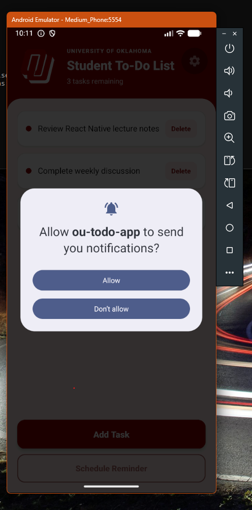
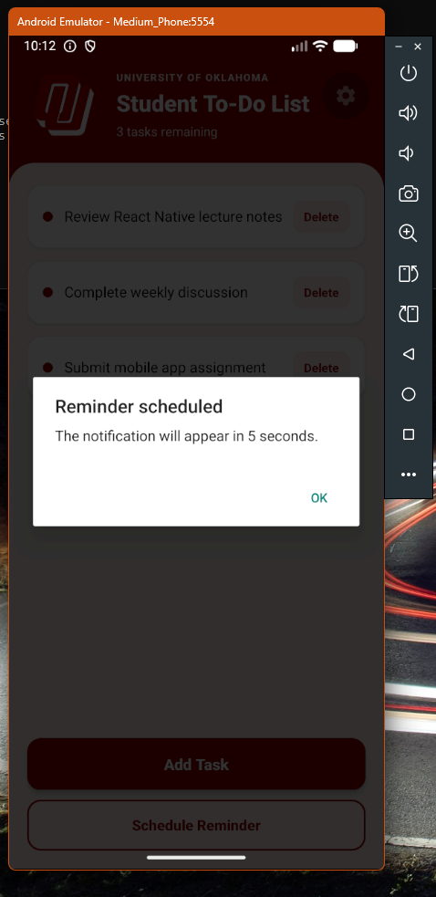
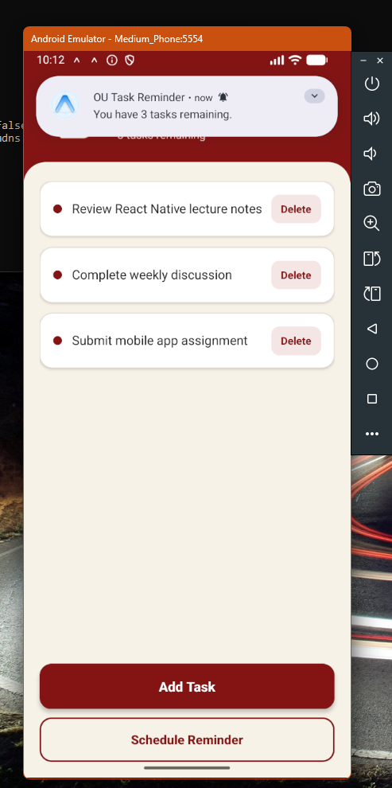

````markdown
# OU Student To-Do List

A simple React Native to-do list app created with Expo.

The app allows users to:

- View a list of tasks
- Add new tasks
- Delete tasks
- Schedule a local task reminder notification

## Local Notification

Pressing the **Schedule Reminder** button creates a local notification that appears after five seconds. The notification displays the number of remaining tasks.

## Screenshots

### Notification Permission

The app requests permission to send notifications.



### Reminder Scheduled

The app confirms that the reminder will appear after five seconds.



### Local Notification

The task reminder appears in the Android notification panel.



## Run the Project

Install the dependencies:

```bash
npm install
````

Build and run the Android development version:

```bash
npx expo run:android
```

After the first build, the development server can be started with:

```bash
npx expo start --dev-client
```

## Technologies

* React Native
* Expo
* Expo Notifications

```
```
